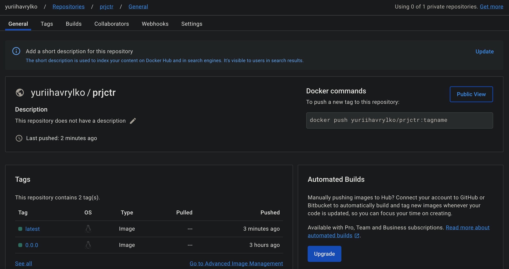
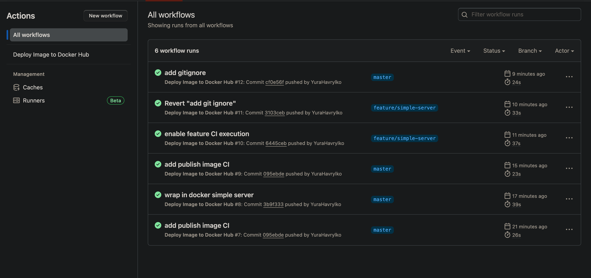

## Projector course work
Skeleton for project on projector course

### Docker 

Build
```
docker build --tag yuriihavrylko/prjctr:latest .
```

Push
Build
```
docker push yuriihavrylko/prjctr:latest
```

DH Images:


### GH Actions:

Works on push to master/feature*


### DVC

Install DVC

```
brew install dvc
```

Init in repo

```
dvc init --subdir
git status
git commit -m "init DVC"
```

Move file with data and add to DVC, commit DBV data config

```
dvc add ./data/data.csv
git add data/.gitignore data/data.csv.dvc
git commit -m "create data"
```

Add remote data storage and push DVC remote config
(ensure that bucket already created)

```
dvc remote add -d minio s3://ml-data
dvc remote modify minio endpointurl [$AWS_ENDPOINT](http://10.0.0.6:9000)

git add .dvc/config
git commit -m "configure remote"
git push 
```

Upload data
```
export AWS_ACCESS_KEY_ID='...'
export AWS_SECRET_ACCESS_KEY='...'
dvc push
```
