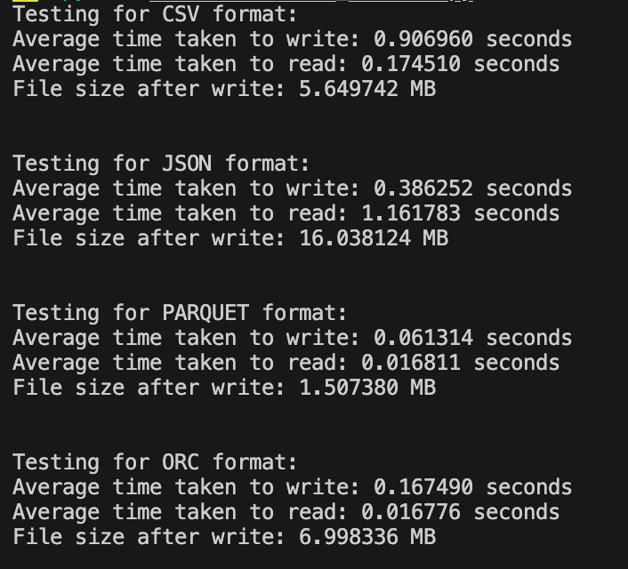

## Projector course work
Skeleton for project on projector course

### Docker 

Build
```
docker build --tag yuriihavrylko/prjctr:latest .
```

Push
Build
```
docker push yuriihavrylko/prjctr:latest
```

DH Images:


### GH Actions:

Works on push to master/feature*


### Minio setup
Mac/Local
```
brew install minio/stable/minio

minio server --console-address :9001 ~/minio # path to persistent local storage + run on custom port
```

Docker

```
docker run \
   -p 9002:9002 \
   --name minio \
   -v ~/minio:/data \
   -e "MINIO_ROOT_USER=ROOTNAME" \
   -e "MINIO_ROOT_PASSWORD=CHANGEME123" \
   quay.io/minio/minio server /data --console-address ":9002"
```

Kubernetes

```
kubectl create -f deployment/minio.yml
```

### Tests

Run tests
```
pytest app/tests/
```

### Benchmarks

Fileformats



| Format   | Avg Write Time (s) | Avg Read Time (s) | File Size after Write (MB) |
|----------|--------------------|-------------------|----------------------------|
| CSV      | 0.906960           | 0.174510          | 5.649742                   |
| JSON     | 0.386252           | 1.161783          | 16.038124                  |
| PARQUET  | 0.061314           | 0.016811          | 1.507380                   |
| ORC      | 0.167490           | 0.016776          | 6.998336                   |


CSV format shows relatively slower write times compared to other formats, with a moderate file size after write.

JSON format demonstrates faster write times but slower read times compared to other formats, with the largest file size after write.

PARQUET format showcases the fastest write times and relatively fast read times, with a smaller file size after write compared to CSV and JSON.

ORC format exhibits moderate write times and the smallest file size after write among the tested formats, with efficient read times.
