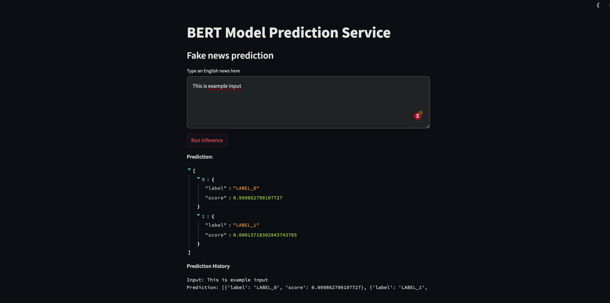
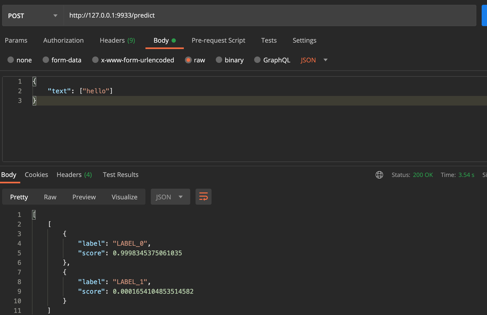
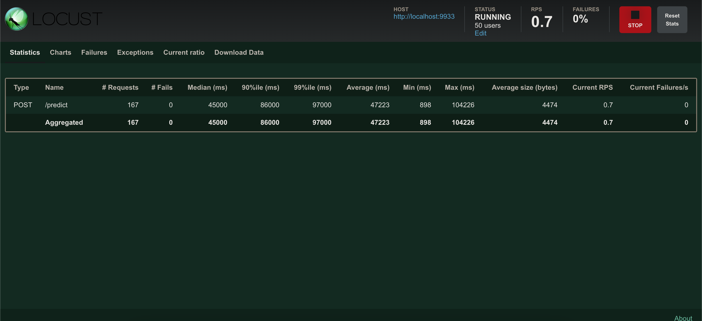

## Projector course work
Skeleton for project on projector course

### Docker 

Build
```
docker build --tag yuriihavrylko/prjctr:latest .
```

Push
Build
```
docker push yuriihavrylko/prjctr:latest
```

DH Images:


### GH Actions:

Works on push to master/feature*


### Streamlit 

Run:
```
streamlit run src/serving/streamlit.py
```



Deploy k8s:
```
kubectl create -f deployment/app-ui.yml
kubectl port-forward --address 0.0.0.0 svc/app-ui.yml 8080:8080
```

### Fast API 

Postman




Deploy k8s:
```
kubectl create -f deployment/app-fasttext.yml
kubectl port-forward --address 0.0.0.0 svc/app-fasttext 8090:8090
```

### Seldon

Instalation

```
kubectl apply -f https://github.com/datawire/ambassador-operator/releases/latest/download/ambassador-operator-crds.yaml
kubectl apply -n ambassador -f https://github.com/datawire/ambassador-operator/releases/latest/download/ambassador-operator-kind.yaml
kubectl wait --timeout=180s -n ambassador --for=condition=deployed ambassadorinstallations/ambassador

kubectl create namespace seldon-system

helm install seldon-core seldon-core-operator --version 1.15.1 --repo https://storage.googleapis.com/seldon-charts --set usageMetrics.enabled=true --set ambassador.enabled=true  --namespace seldon-system
```

Deploy k8s:
```
kubectl create -f deployment/seldon-custom.yaml
```

### Kserve

Deploy k8s:

```
kubectl create -f deployment/kserve.yaml
kubectl get inferenceservice custom-model
```

### Load testing



```
locust -f benchmarks/load_test.py --host=http://localhost:9933 --users 50 --spawn-rate 10 --autostart --run-time 600s
```

### POD autoscaling

Install metric service

```
kubectl apply -f https://github.com/kubernetes-sigs/metrics-server/releases/latest/download/components.yaml
kubectl patch -n kube-system deployment metrics-server --type=json -p '[{"op":"add","path":"/spec/template/spec/containers/0/args/-","value":"--kubelet-insecure-tls"}]'
```

Run from config

```
kubectl create -f deployment/fastapi-hpa.yaml
```
