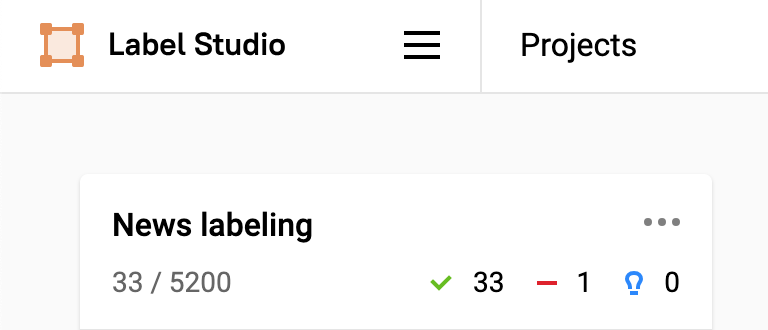

## Projector course work
Skeleton for project on projector course

### Docker 

Build
```
docker build --tag yuriihavrylko/prjctr:latest .
```

Push
Build
```
docker push yuriihavrylko/prjctr:latest
```

DH Images:


### GH Actions:

Works on push to master/feature*


### Streamlit 

Run:
```
streamlit run src/serving/streamlit.py
```


Deploy k8s:
```
kubectl create -f deployment/app-ui.yml
kubectl port-forward --address 0.0.0.0 svc/app-ui.yml 8080:8080
```

Deploy k8s:
```
kubectl create -f deployment/app-ui.yml
kubectl port-forward --address 0.0.0.0 svc/app-ui.yml 8080:8080
```


### Fast API 

Postman


Deploy k8s:
```
kubectl create -f deployment/app-fasttext.yml
kubectl port-forward --address 0.0.0.0 svc/app-fasttext 8090:8090
```

### Seldon

Instalation

```
kubectl apply -f https://github.com/datawire/ambassador-operator/releases/latest/download/ambassador-operator-crds.yaml
kubectl apply -n ambassador -f https://github.com/datawire/ambassador-operator/releases/latest/download/ambassador-operator-kind.yaml
kubectl wait --timeout=180s -n ambassador --for=condition=deployed ambassadorinstallations/ambassador

kubectl create namespace seldon-system

helm install seldon-core seldon-core-operator --version 1.15.1 --repo https://storage.googleapis.com/seldon-charts --set usageMetrics.enabled=true --set ambassador.enabled=true  --namespace seldon-system
```

Deploy k8s:
```
kubectl create -f deployment/seldon-custom.yaml
```

### Kserve

Deploy k8s:

```
kubectl create -f deployment/kserve.yaml
kubectl get inferenceservice custom-model
```


### Load testing


```
locust -f benchmarks/load_test.py --host=http://localhost:9933 --users 50 --spawn-rate 10 --autostart --run-time 600s

### DVC

Install DVC

```
brew install dvc
```

Init in repo

```
dvc init --subdir
git status
git commit -m "init DVC"
```

Move file with data and add to DVC, commit DBV data config

```
dvc add ./data/data.csv
git add data/.gitignore data/data.csv.dvc
git commit -m "create data"
```

Add remote data storage and push DVC remote config
(ensure that bucket already created)

```
dvc remote add -d minio s3://ml-data
dvc remote modify minio endpointurl [$AWS_ENDPOINT](http://10.0.0.6:9000)

git add .dvc/config
git commit -m "configure remote"
git push 
```

Upload data
```
export AWS_ACCESS_KEY_ID='...'
export AWS_SECRET_ACCESS_KEY='...'
dvc push


### Label studio

```
docker pull heartexlabs/label-studio:latest
docker run -it -p 8080:8080 -v `pwd`/mydata:/label-studio/data heartexlabs/label-studio:latest
```




### Minio setup
Mac/Local
```
brew install minio/stable/minio

minio server --console-address :9001 ~/minio # path to persistent local storage + run on custom port
```

Docker

```
docker run \
   -p 9002:9002 \
   --name minio \
   -v ~/minio:/data \
   -e "MINIO_ROOT_USER=ROOTNAME" \
   -e "MINIO_ROOT_PASSWORD=CHANGEME123" \
   quay.io/minio/minio server /data --console-address ":9002"
```

Kubernetes

```
kubectl create -f deployment/minio.yml
```

### POD autoscaling

Install metric service

```
kubectl apply -f https://github.com/kubernetes-sigs/metrics-server/releases/latest/download/components.yaml
kubectl patch -n kube-system deployment metrics-server --type=json -p '[{"op":"add","path":"/spec/template/spec/containers/0/args/-","value":"--kubelet-insecure-tls"}]'
```

Run from config

```
kubectl create -f deployment/app-fastapi-scaling.yml
```
